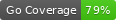

# rislive

(Apache2.0 License Applies)

Golang client to connect to the RIPE RIS Live firehose, and listen for interesting events.

TODO(morrowc):
  o Enable filtering of the view/prefixes properly.
  o Enable RPKI marking based upon CloudFlare's data at:
     https://rpki.cloudflare.com/rpki.json

Coverage and testing:
  o go test -coverprofile=coverage.out
  o go tool cover -func=coverage.out
  o go tool cover -html=coverage.out
